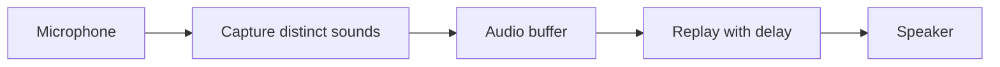

# Echo Chamber

An interactive, client-side audio experience that listens through the device microphone, captures distinctive sounds, and replays them with a delay.

## Overview

Echo Chamber turns the microphone into a playful feedback loop. The app listens for sounds, captures them, and plays them back after a short delay — so you hear yourself (or your environment) echoed back in real time.



This is **not** speech-to-text. There is no filter for words in a specific language. Any sound that can be distinctively identified from background noise can be echoed — claps, whistles, laughs, humming, spoken words, and more.

The experience is **fully client-side**. No server, no uploads. Microphone audio never leaves the device.

## Goals

| Goal | Detail |
|------|--------|
| Cross-platform | Works in modern browsers on phones and computers |
| Low latency feel | Responsive enough that the echo feels immediate, not sluggish |
| Minimal initial scope | Ship a working fixed-delay echo first; layer complexity later |
| Extensible architecture | Audio pipeline should accept future effects (pitch, speed, VAD gating) without a rewrite |
| Zero install | Standalone web app — open a URL, grant mic permission, start echoing |

## Open Design Questions

It is not yet clear which experience will be most interesting or entertaining. These are the main areas to explore:

### 1. Replay timing

- **Fixed delay** (simplest): echo everything after N milliseconds.
- **Pause-aware**: wait for a gap in input before replaying, so playback does not cut you off mid-sound.
- **Overlap vs. replace**: stack multiple echoes, or cancel an in-progress replay when new input arrives?

### 2. Sound detection

- **Energy/volume threshold** vs. ML voice-activity detection (e.g. [vad-web](https://github.com/ricky0123/vad-web)).
- Sensitivity tuning for noisy environments.

### 3. Audio transformations (future)

- Pitch: up or down an octave.
- Tempo: speed up or slow down.
- Character: sing-song, robotic, reverb, and other effects.
- Should transforms be random, user-selected, or adaptive?

### 4. UX

- Single delay knob vs. presets ("cave", "robot", "choir").
- Visual feedback (waveform, level meter) vs. audio-only.
- Clear handling of permission-denied and silent-mic error states.

### Initial MVP

The first version should be deliberately small:

- Fixed delay replay
- Volume-threshold gating (ignore background noise below a threshold)
- No audio transforms

Everything else in this section is follow-on experimentation.

## Technical Approach

The app should work as a standalone web app with all processing on the client. Target phones and computers as long as microphone access is available.

### Core APIs (built into browsers)

- [`getUserMedia`](https://developer.mozilla.org/en-US/docs/Web/API/MediaDevices/getUserMedia) — microphone access
- [Web Audio API](https://developer.mozilla.org/en-US/docs/Web/API/Web_Audio_API) — capture, buffer, delay, and playback
- [`AudioWorklet`](https://developer.mozilla.org/en-US/docs/Web/API/AudioWorklet) — low-latency processing off the main thread

These cover the MVP without additional dependencies.

### Scaffolding

- [Vite](https://vitejs.dev/) + TypeScript — fast dev server, static build, easy deploy to any static host
- Vanilla TypeScript for the first version; add a UI framework only if the interface grows complex

### Optional libraries (add when needed)

| Need | Library | Why |
|------|---------|-----|
| Delay line + routing | Web Audio `DelayNode` | Built-in; sufficient for MVP |
| Higher-level audio graph | [Tone.js](https://tonejs.github.io/) | Pitch shift, effects chain, transport — if built-in nodes feel limiting |
| Pause-aware detection | [vad-web](https://github.com/ricky0123/vad-web) | ONNX-based VAD in WASM; good for "wait for pause" mode |
| Pitch/tempo (advanced) | [soundtouchjs](https://github.com/cutterbl/SoundTouchJS) or Tone.js `PitchShift` | Independent pitch and tempo control |

### Deployment

- Output is static files only (Vite `dist/`) — GitHub Pages, Netlify, Cloudflare Pages, or any static host
- **HTTPS is required** for microphone access on non-localhost origins

### Browser support

- Target evergreen Chrome, Safari (iOS 14.5+), Firefox, and Edge
- iOS Safari requires a user gesture to start the audio context — the UI should account for this

## Development

```bash
npm install
npm run dev      # local dev server
npm test         # unit tests
npm run build    # production build
```

See [docs/development.md](docs/development.md) for the TDD workflow, project layout, and manual microphone checklist. See [CONTRIBUTING.md](CONTRIBUTING.md) for branch naming and PR conventions.

## Project Status

**MVP complete.** The app captures microphone input, replays it with a configurable delay, and gates output by volume threshold. Open design questions (pause-aware replay, transforms, presets) remain for follow-on work.

### Next steps

1. ~~Scaffold Vite + TypeScript~~
2. ~~Implement microphone capture and fixed-delay echo MVP~~
3. ~~Add volume-threshold gating~~
4. Iterate on the open design questions above

Contributions and experiments should update the Open Design Questions section as decisions are made.